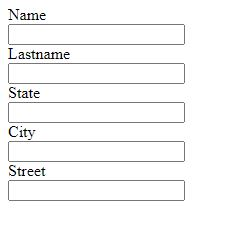

# reForm-js

# Notice: Under development. Not ready. all suggestions, feedbacks and contribution is welcomed


ReformJS is a Javascript library developed for building form in detail, validating and managing easily.
All definitions, validations are made with a object. Inputs, elements are placed according to these definitions.
And all value changes are tracked by Reflectors. Values is placed by sections and made ready for use. 

## Getting Started

You can install ReformJS via 

```npm install @morphosium/reform``` 

or  

```<script src="./path-of-reform/reform.js">```

Code implementation will be like this

```
/** You can consider use import or require if installed by npm
    import { Reflector, InputField, SectionField, EventObserve } from "@morphosium/reform";
 */
const { Reflector, InputField, SectionField, EventObserve } = Reform
const reflector = new Reflector(
    {
        content: [
            new InputField({
                name: "name",
                label: "Name",
            }),
            new InputField({
                name: "lastname",
                label: "Lastname",
            }),
            /* Sections is represents values group. 
            At the final value: State, City and Streets values will be under "address" field */
            new SectionField({
                name: "address",
                content: [
                    new InputField({
                        name: "state",
                        label: "State",
                    }),
                    new InputField({
                        name: "city",
                        label: "City",
                    }),
                    new InputField({
                        name: "street",
                        label: "Street",
                    }),
                ]
            })
        ]
    }
);

/* Form elements will be added into div element those id "base" */
reflector.expandThere("#base");

/* Each value changes notified and new value is written into console */
reflector.onValueChange.subscribe(
    new EventObserve(
        value => {
            console.info(reflector.getValue())
        }
    )
)
```

In any browser screen, shown as like following



At the same time,at each value change of any input, new value is written in console like this


## Terminology

**Initial fields** represents form build instructions. 

Initial fields are separated within itself as *InputField*, *ElementField* and *SectionField*

**InputFields** are user input instructions contains *name, label, validations* and etc.

**ElementField** represents HTMLElement, contains another InitialFields. But at the reflecting into browser, inputs will be seperated according ElementField definitions.

**SectionField** represents object at the value, contains child input and section values

**Reflector** builds form on the screen by provided instructions. At needed, values and validation issues can be fetched from reflector. 

and *(In development for now)* another reflections of initial fields can be made some changes by reaching reflector.


## Detailed info

Documentation will be released as soon as.

Some examples available pages in testings folder. testing pages scripts are located in src/testings/

## Roadmap

We are planning develop that framework for our requirements. At the future, We decided to add following features

- "Select" input with options

- Initial field definition as HTML-Similar format

- Translation of error message (Firstly Turkish)

At the same time. New features planned are going to be in "projects" page of github page

In this development progress, your feedbacks, improvements, (and if you wish, contribution) will be welcomed

## Contact

- Hüseyin Can Gündüz

  - github: @huseyincangunduz

  - instagram: @hussainlobo

  - twitter: @hcangunduz

  - email: hcangunduz@gmail.com

- Repo issues tab